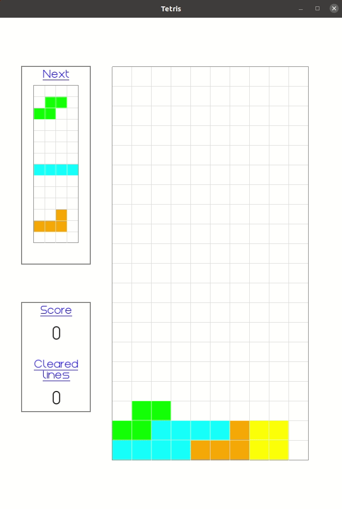
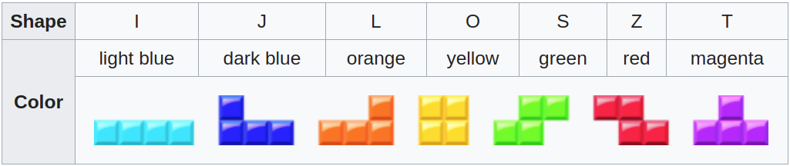
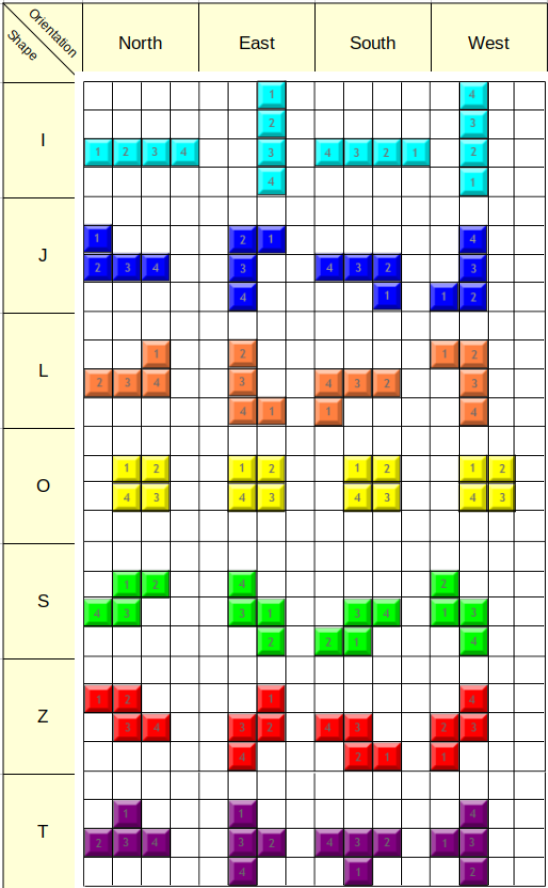

# Motivation
This is the capstone project in the [Udacity C++ Nanodegree Program](https://www.udacity.com/course/c-plus-plus-nanodegree--nd213). The motivation of the capstone project is to integrate all C++ features taught throughout the C++ Nanodegree program. The idea for the project has been either to create independently a C++ application of my choice using a wide range of the modern C++ features (Option 1) or to add features to an existing project (Option 2). I made my decision for option 1 and created a simple version of the Tetris game from scratch using SFML as a library providing an API to various multimedia components. The code has been developed and tested on ubuntu using C++ 17 and cmake.

# Tetris Game



The aim of Tetris is simple. You bring down the so-called tetromino shapes from the top of the screen. You can **move the shapes horizontally** in both directions **via left/right-arrow-keys**. In addition, you can **rotate them clockwise via up-arrow-key**. The shapes fall at a certain rate from top to bottom, but you can also **accelerate the falling via the down-arrow-key**.

Tetris has very simple rules: you can only move the pieces in specific ways. Your game is over if your pieces reach the top of the screen. You can only remove pieces from the screen by filling all the blank space in a line. Your objective is to get all the tetrominoes to fill all the empty space in a line at the bottom of the screen. Whenever you do this, you'll find that the blocks vanish and you get awarded some points according to the following table:

| Line clear | Points |
|------------|--------|
| 1 (single) |    40  |
| 2 (double) |   100  |
| 3 (triple) |   300  |
| 4 (tetris) |  1200  |

For the sake of simplicity, the fall down rate of tetrominoes is independent of the awarded points and hence constant. This is sufficient to demonstrate some C++ features which you can find in the rubric further down.

# Running code

## Dependencies for running locally

Although the game has been developed without restriction to a specific platform, it was tested on a Linux machine only. Hence the following dependencies relate only to Linux OS.
* cmake >= 3.11.3
  * [click here for installation instructions](https://cmake.org/install/)
* make >= 4.2.1
  * [install Xcode command line tools to get make](https://developer.apple.com/xcode/features/)
* gcc/g++ >= 5.4
  * gcc / g++ is installed by default on most Linux distros. If this is not the case, you can install it e.g. on Ubuntu via `sudo apt install build-essential`
* SFML >= 2.5.1 [General info](https://www.sfml-dev.org/)
  * sudo apt-get install libsfml-dev


## Basic build instructions for Linux

1. Clone the entire repo using HTTPS:
   ```git clone https://github.com/eugen-schaefer/Tetris.git```
2. Make a build directory at the top level of the cloned repo and change into it: `mkdir build && cd build`
3. Compile: `make .. && make`
4. Run the resulting executable from the build folder: `./src/TetrisApp`


## How to execute tests

You can run all tests by executing `./test/run_tests.sh` from the repository root.
You can also execute individual tests:
1. Follow the build instruction above
2. From the build folder execute ./test/<testname> where <testname> is the name of the desired test e.g. `./test/TetrominoTest`.


## Overview of the code structure

### main.cpp

Here is the entry point for the program. The main function in this file creates a window with a fixed height and width in which the game will be rendered. Furthermore, the main function loads a font for all text elements in the game and instantiates a controller. Finally, the instantiated controller starts the game.

### Controller class
This class controls the entire game. It retrieves the keyboard events and forwards them to the game class but also triggers periodic drops of the active shape. In the end, this class triggers the rendering of all graphics.

### Game class
The Game class provides all necessities to start a game. Concrete, it constructs the Tetris grid, a dashboard, and all tetrominoes falling from top to bottom. Tetrominoes are organized in the following way: Once a tetromino shape is randomly generated, it is pushed into a waiting queue containing three tetrominoes in total. Then one tetromino is poped from another end of the queue and referred to as an active shape. The player can relocate and rotate this active shape as long as it is not locked down. When the active shape has reached the lowest possible free line on the grid, it is then locked down and pushed into another container that contains all the locked shapes. Furthermore, the Game class offers methods to process keyboard events, shapes lock down and to restart the game.

### Grid
One of the central elements in the game is the playing field which is shaped by a grid. To decouple the logic from the drawing which is dependent on a drawing library (SFML in our case) there exist two grid classes:

#### GridLogic class
The GridLogic class keeps track of the playfield, which is a grid into which the tetrominoes are falling. So the class determines whether the active figure can be moved or rotated in the grid or not. The associated grid is also referred to as the logical grid. The x-axis is vertical and counts positive from top to bottom whereas the y-axis is horizontal counting positive from left to right.

#### GridGraphic class
The GridGraphic class draws the grid on the screen into which the single tetrominoes are supposed to be drawn. As opposed to the GridLogic, the x-axis is horizontal and counts positive from left to right whereas the y-axis is vertical counting positive from top to bottom.

### Tetrominoes
A tetromino is a geometric shape composed of four squares, connected orthogonally (i.e. at the edges and not the corners). These are the different shaped pieces that descend into the grid out of the waiting queue. Similar to the playing field (grid), the logic is decoupled from the graphic here as well.

#### Tetromino class
Tetromino class is the base class for all seven tetromino shapes. It provides common properties like color and actions like a move in a certain direction for all shapes.

#### Shape[X] class
There are 7 different tetromino types in the game. These tetrominoes are named by the letter of the alphabet they most closely resemble. 



The Shape[X] class represents concrete shape [X] where [X] stands for one of the seven shapes introduced above. Apart from inherited methods, each class provides in addition a concrete implementation of the shape rotation and the shape orientation.



#### TetrominoGraphic class
 TetrominoGraphic class draws a concrete tetromino shape on the screen. Its size and position is relative to the associated grid in which the shape is beeing drawn.

 ### Dashboard class
The dashboard provides information to the player about the current game's state. It shows the queue of the upcoming shapes being drawn as the next elements after the currently active shape is locked down. It also informs the player about the scoring and how many lines have been cleared since the game start.

## Applied C++ features

### Loops, Functions, I/O

| CRITERIA   | Example in code |
|------------|-----------------|
| The project demonstrates an understanding of C++ functions and control structures. |  Tetromino.cpp: Tetromino::MoveOneStep    |
| The project reads data from a file and process the data, or the program writes data to a file. |   main.cpp:  a praticular font is loaded from file |
| The project accepts user input and processes the input. |  Game.cpp:  Game::ProcessKeyEvent |

### Object Oriented Programming
| CRITERIA   | Example in code |
|------------|-----------------|
| The project uses Object Oriented Programming techniques. | GridLogic.h: GridLogic class |
| Classes use appropriate access specifiers for class members. | Tetromino.h: Tetromino class |
| Class constructors utilize member initialization lists. | Tetromino.h: Tetromino class |
| Classes abstract implementation details from their interfaces. | GridLogic.h/cpp: GridLogic class |
| Classes encapsulate behavior. | GridLogic.h/cpp: GridLogic class |
| Classes follow an appropriate inheritance hierarchy. | IGridLogic.h GridLogic.h/cpp |
| Derived class functions override virtual base class functions. | IGridLogic.h GridLogic.h/cpp |


### Memory Management
| CRITERIA   | Example in code |
|------------|-----------------|
| The project makes use of references in function declarations. | Controller.h: In constructor window and font are passed by reference |
| The project uses scope / Resource Acquisition Is Initialization (RAII) where appropriate. | GridLogic.h/cpp: GridLogic class |
| The project uses move semantics to move data, instead of copying it, where possible. | Tetromino.h: SetPosition(TetrominoPositionType target_position) |
| The project uses smart pointers instead of raw pointers. | Game.h: m_active_shape is a unique pointer |


### License
This project is licensed under the MIT License - see the [LICENSE](LICENSE) file for details
